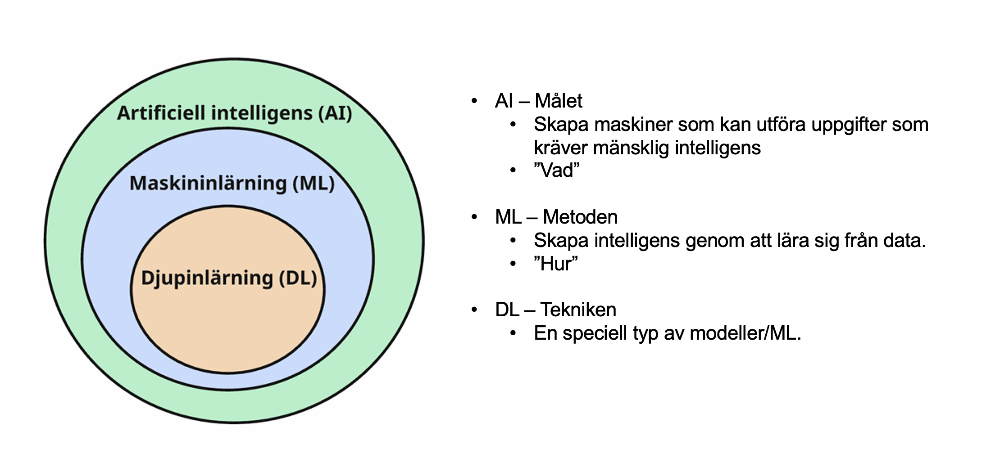
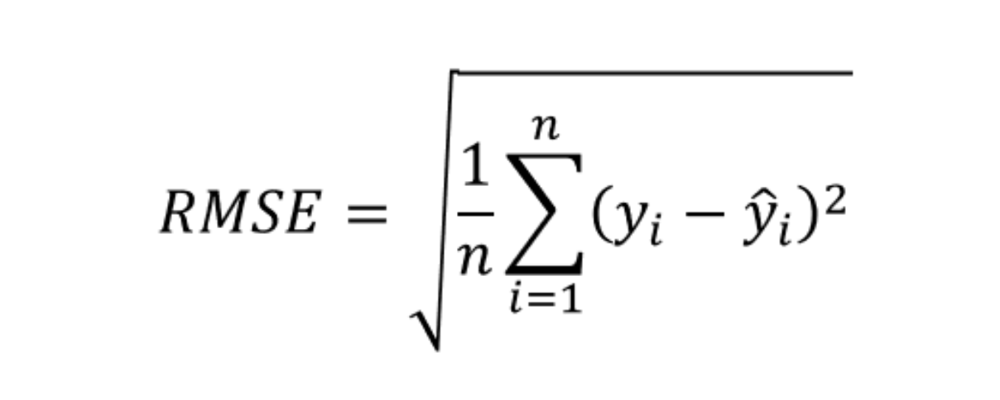

# Del 1

## Teoretiska frågor
Denna del syftar till att vi ska börja tänka på vissa grundläggande och centrala
koncept inom maskininlärning som är en central del inom AI. Svara gärna kort och
koncist. Inkludera svaren som ett sista avsnitt i din rapport.

1. Förklara vad AI, ML respektive DL är och relationen mellan begreppen.

{width=100% fig-align="center"}

> AI är förmågan hos datorer att efterlikna människörs intelligens. 

> ML är metoden för att utveckla algoritmer som kan lära sig från data och göra prediktioner eller beslut utan att vara explicit programmerade för varje uppgift. 

> DL är en delmängd av ML som använder artificiella neurala nätverk med flera lager (därav "djup") för att modellera komplexa mönster i data.

2. Julia delar upp sin data i träning och test. På träningsdatan så tränar hon tre modeller; ”Linjär Regression”, ”Lasso regression” och en ”Random Forest modell”. Hur skall hon välja vilken av de tre modellerna hon skall fortsätta använda när hon inte skapat ett explicit ”valideringsdataset”?
>  Hon kan använda sig av k-delad korsvalidering på träningsdatan för att utvärdera de tre modellerna och välja den som presterar bäst på valideringsdatan.
> Alternativt kan hon använda sig av en metod som kallas "train-test split" där hon delar upp träningsdatan i ett mindre träningsset och ett valideringsset. Hon kan sedan träna modellerna på det mindre träningssetet och utvärdera dem på valideringssetet för att välja den bästa modellen.
> K-delad korsvalidering är oftast att föredra eftersom det ger en mer robust utvärdering av modellens prestanda och minskar risken för överanpassning till valideringssetet. särskilt när datamängden är liten.

3. Vad är ”regressionsproblem? Kan du ge några exempel på modeller som används och potentiella tillämpningsområden?

> Regeressionsproblem är en typ av problem där målet är att prediktera ett kontinuerligt värde baserat på en eller flera oberoende variabler. 

> Exempel på modeller som används för regressionsproblem inkluderar linjär regression, ridge regression, lasso regression, Elastic net, support vector machines, beslutsträd, Ensemble learning, och random forest. 

> Tillämpningsområden för regressionsproblem kan vara att prediktera huspriser baserat på olika faktorer som storlek och läge, att prediktera löner baserat på utbildning och erfarenhet, eller att prediktera aktiekurser baserat på historiska data.

4. Antag att vi har följande regressionsmodell: 𝑌 = 𝛽0 + 𝛽1𝑋 + 𝜀, vad kallas Y, X, 𝛽i och 𝜀 ?

Boken S122:

> Y: Den beroende variabeln eller målet som vi vill prediktera.

> X: Den oberoende variabeln eller den prediktor som används för att prediktera Y.

> 𝛽0: Interceptet eller konstanten i modellen, som representerar värdet av Y när X är noll

> 𝛽1: Den linjära koefficienten som representerar effekten av X på Y.

> 𝜀: Feltermen eller residualen, som representerar skillnaden mellan den faktiska och den predikterade värdet.

5. Hur kan du tolka RMSE och vad används det till?

{width=100% fig-align="center"}

Boken S106:

> RMSE står för Root Mean Squared Error och är ett mått på hur väl en regressionsmodell predikterar det faktiska värdet. Det beräknas genom att ta kvadratroten av medelvärdet av de kvadrerade skillnaderna mellan de faktiska och predikterade värdena.

> RMSE används för att kunna tolka hur stort fel en modell gör. Ett lägre RMSE indikerar en bättre passform av modellen till data. Det är särskilt använd för att jämföra olika modeller eller för att utvärdera hur väl en modell presterar på nya data.

6. Vad är ”klassificieringsproblem? Kan du ge några exempel på modeller somanvänds och potentiella tillämpningsområden?

Boken S151:

> Klassificeringsproblem är en typ av problem där målet är att prediktera kategoriska utdata med hjälp av indata.

Boken S166:

> Exempel på modeller som används för klassificeringsproblem inkluderar logistisk regression, support vector machines, beslutsträd, Ensemble learning, random forest.

Boken S151:

> Tillämpningsområden för klassificeringsproblem kan vara:

> * Kundanalys - prediktera om en kund kommer att köpa en produkt eller inte, att segmentera kunder i olika grupper baserat på deras beteende, eller att prediktera kundlojalitet.

> * Sjukvård - att prediktera om en patient har en viss sjukdom eller inte (sjuk eller frisk) baserat på medicinska data såsom blodtryck, puls och så vidare.

> * Bildigenkänning - att klassificera bilder i olika kategorier, såsom att identifiera om en bild innehåller en katt eller en hund.

> * Anomalidetektion - att identifiera defekta produkter i en tillverkningsprocess, att upptäcka bedrägerier i finansiella transaktioner, eller att identifiera avvikande beteende i nätverkssäkerhet.

> * Finans - Preddiktera om en aktie kommer att gå upp eller ner baserat på exempelvis företagsinformation såsom lönsamhet, omsättning och så vidare.

> * Kreditrisk - Bedöma om en bankkund ska beviljas ett lån eller inte baserat på faktorer som inkomst, ålder, civilstånd och så vidare.

7. Vad är en ”confusion matrix”?

{width=100% fig-align="center"}

Boken S155

> en confusion matrix är en matris som visualiserar hur väl en modell presterar genom att jämföra sanna och predikterade värden.

8. Hur definieras Precision? Hur tolkas Precision?

Boken S159:

> Precision mäter andelen av de positiva prediktionerna som faktiskt är korrekta. Det beräknas som:
> Precision = TP / (TP + FP)
> där TP är antalet sanna positiva och FP är antalet falska positiva.

> Precision tolkas som hur många av de positiva prediktionerna som är korrekta. En hög precision indikerar att modellen har få falska positiva, vilket är viktigt i situationer där det är kostsamt att göra en falsk positiv prediktion, såsom i medicinsk diagnostik eller bedrägeribekämpning.

9. Hur definieras Recall? Hur tolkas Recall?

Boken S159:

> Recall mäter andelen av den positiva klassen som har predikterats korrekt. Det beräknas som:
> Recall = TP / (TP + FN)
> där TP är antalet sanna positiva och FN är antalet falska negativa.

> Recall tolkas som hur många av de faktiska positiva som har identifierats. En hög recall indikerar att modellen har få falska negativa, vilket är viktigt i situationer där det är kostsamt att missa en positiv prediktion, såsom i medicinsk diagnostik eller detektering av sällsynta sjukdomar.

10. Göran påstår att datan antingen är ”ordinal” eller ”nominal”. Julia säger att detta måste tolkas. Hon ger ett exempel med att färger såsom {röd, grön, blå} generellt sett inte har någon inbördes ordning (nominal) men om du har
en röd skjorta så är du vackrast på festen (ordinal) – vem har rätt?

Boken S42:

> Julia har rätt – det handlar om tolkning, inte om att datan i sig alltid är av en viss typ oberoende av sammanhang.

11. Vad är skillnaden mellan parametrar och hyperparametrar i en maskininlärningsmodell? Ge ett exempel på varje och förklara varför de inte kan optimeras på samma sätt.

Boken S35:

> En hyperparameter svarar på frågan "hur vi lär oss" och en parameter svarar på frågan "vad vi lärt oss".

12. Förklara skillnaden mellan overfitting och underfitting i en maskininlärningsmodell. Beskriv även hur man kan upptäcka respektive åtgärda dem.

> Overfitting (överanpassning)

> Vad är det?

> * Modellen är för komplex och lär sig inte bara mönster utan också brus och slumpmässiga variationer i träningsdatan.

>Kännetecken:

> * Mycket låg träningsförlust (nästan perfekt på träningsdata)

> * Mycket hög valideringsförlust (presterar dåligt på ny data)

> * Stort gap mellan tränings- och valideringsfel

> Hur upptäcker man dem?
> * Genom att utvärdera modellens prestanda på både tränings- och valideringsdata. Om modellen presterar mycket bättre på träningsdata än på valideringsdata, kan det vara ett tecken på överanpassning.

> Hur åtgär

> * Förenkla modellen

> * Regularisering

> * Öka mängden träningsdata

> Underfitting (underanpassning)

> Vad är det?

> * Modellen är för enkel och misslyckas med att fånga det underliggande mönstret i träningsdatan.

> Kännetecken:

> * Hög valideringsförlust (ungefär lika hög som träningsförlust)

> * Modellen presterar dåligt på både gammal och ny data

> Analogi:

> * Försöka beskriva en parabel med en rät linje – du missar kurvan helt.

> Hur upptäcker man dem?

> * Inlärningskurvan planar ut på en hög nivå (både train och val)

> * Modellen är sämre än enkel baseline (t.ex. medelvärde)

> * Träningsfelet är inte lågt nog

> Hur åtgärdar man dem?

> * Öka modellens komplexitet

> * Förbättra träningsprocessen

> * Förbättra data

13. Hur funkar OvO och OvR algoritmerna?

> OvO (One-vs-One)

> Så fungerar det:

> För K klasser tränar du K(K-1)/2 binära klassificerare – en för varje par av klasser.

> Varje klassificerare lär sig att skilja på exakt två klasser (ignorerar alla andra).

> Prediktion: Kör alla modeller. Varje modell "röstar" på en av sina två klasser. Vinnaren = den klass som får flest röster.

> OvR (One-vs-Rest)

> Så fungerar det:

> För K klasser tränar du K binära klassificerare:

> Varje klassificerare lär sig att skilja på en klass (positiv) mot alla andra klasser (negativ).

> Prediktion: Kör alla modeller. Varje modell ger en sannolikhet för sin klass. Vinnaren = den klass med högst sannolikhet.

14. Vad är intuitionen bakom att regularisera en modell?

> Regularisering handlar i grunden om att straffa komplexitet – att medvetet göra modellen lite sämre på träningsdatan för att den ska bli mycket bättre på ny data.

15. Vad är Bias Variance Trade-off?

> Bias-Variance Trade-off handlar om att hitta en balans mellan två typer av fel i en modell:

> * Bias (fördom) – fel som uppstår när modellen är för enkel och inte kan fånga det underliggande mönstret i datan (underfitting).
> * Variance (varians) – fel som uppstår när modellen är för komplex och lär sig brus och slumpmässiga variationer i träningsdatan (overfitting).

> En modell med hög bias och låg varians kommer att underfitta, medan en modell med låg bias och hög varians kommer att överfitta. Målet är att hitta en modell som har en bra balans mellan bias och varians för att uppnå optimal generalisering på nya data.

16. Varför är mer komplexa modeller inte alltid bättre?

> Mer komplexa modeller är inte alltid bättre eftersom de kan leda till överfitting, där modellen lär sig inte bara de underliggande mönstren i träningsdatan utan också brus och slumpmässiga variationer. Detta resulterar i att modellen presterar mycket bra på träningsdatan men dåligt på ny data. Dessutom kan mer komplexa modeller vara svårare att tolka och kräva mer beräkningsresurser, vilket inte alltid är önskvärt eller nödvändigt beroende på problemet som ska lösas. I många fall kan en enklare modell med rätt regularisering och tillräcklig data ge bättre generalisering än en mer komplex modell.

17.  Kan du kort förklara hur fixa men okända parametrarna 𝛽0, 𝛽1, … , 𝛽p skattas med hjälp av MSE?
>  För att skatta de okända parametrarna 𝛽0, 𝛽1, … , 𝛽p i en regressionsmodell använder vi metoden för minsta kvadrater (OLS), som försöker minimera summan av kvadrerade residualer (MSE).

> MSE (Mean Squared Error) beräknas som:
> MSE = (1/n) * Σ(yi - ŷi)²
> där yi är det faktiska värdet, ŷi är det predikterade värdet från modellen, och n är antalet observationer.

> Genom att minimera MSE kan vi hitta de värden på 𝛽0, 𝛽1, … , 𝛽p som gör att modellen bäst passar träningsdatan. Detta görs vanligtvis genom att ta derivatan av MSE med avseende på varje parameter och sätta den lika med noll för att lösa för parametrarna.

18. I frågan ovan, varför används MSE och inte RMSE? Vad är skillnaden?

> MSE (Mean Squared Error) används ofta i optimeringsprocessen för att skatta parametrarna i en regressionsmodell eftersom det är en kvadratisk funktion som är lätt att derivera och optimera. MSE straffar större fel mer än mindre fel, vilket kan hjälpa till att hitta en bättre passform för modellen. RMSE (Root Mean Squared Error) är bara roten ur MSE och ger en uppskattning av felstorleken i samma enheter som data, men det är inte lika lätt att derivera och optimera som MSE. Därför används MSE i själva optimeringsprocessen, medan RMSE ofta används som ett mer intuitivt mått på modellens prestanda efter att parametrarna har skattats.

19. Vad betyder övervakad respektive oövervakad maskininlärning?
> Övervakad maskininlärning innebär att modellen tränas på en dataset som innehåller både indata (features) och motsvarande utdata (labels). Målet är att lära sig en funktion som kan mappa indata till utdata, så att modellen kan göra korrekta prediktioner på nya, osedda data. Exempel på övervakade algoritmer inkluderar linjär regression, logistisk regression, beslutsträd och support vector machines.  
> Oövervakad maskininlärning innebär att modellen tränas på en dataset som endast innehåller indata (features) utan några motsvarande utdata (labels). Målet är att hitta mönster, strukturer eller grupperingar i datan utan någon specifik vägledning. Exempel på oövervakade algoritmer inkluderar klustring (t.ex. K-means), dimensionalitetsreduktion (t.ex. PCA) och associationsregler (t.ex. Apriori).

20. Vad är prediktions- respektive konfidensintervall? Vilket intervall är bredast och varför?
> Ett prediktionsintervall ger en uppskattning av det område där det faktiska värdet för en ny observation sannolikt kommer att ligga. Ett konfidensintervall ger en uppskattning av det område där den verkliga parametern ligger. Prediktionsintervallet är alltid bredare än konfidensintervallet eftersom det tar hänsyn till både osäkerhet i modellens skattningar och den variabilitet som finns i de nya observationerna.
